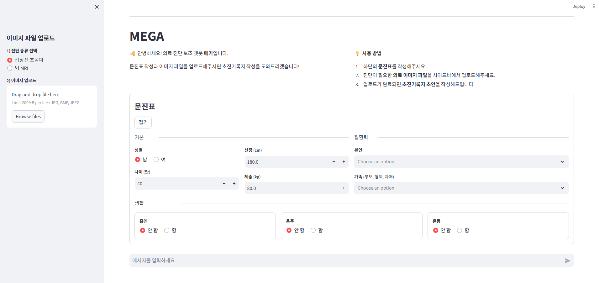
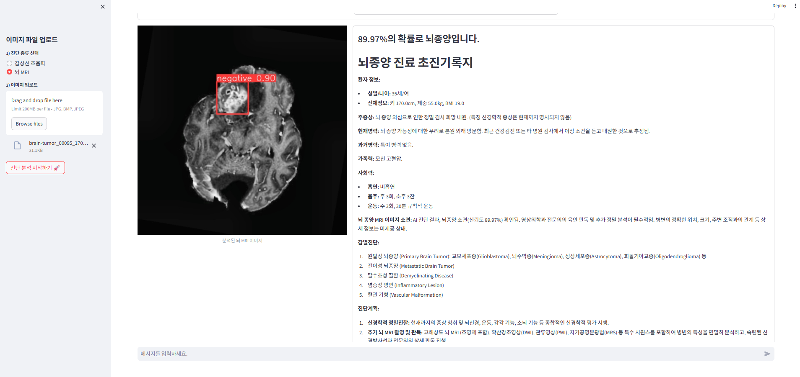
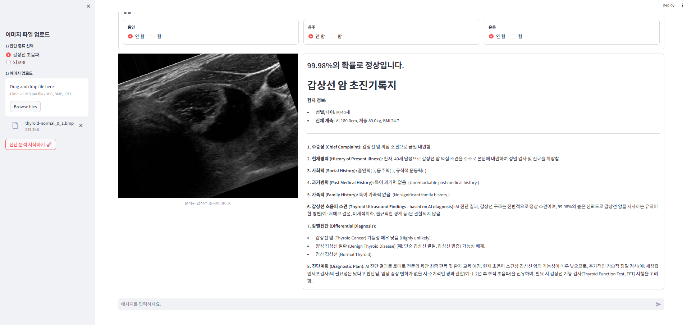

# 🏥 MEGA: AI 의료 진단 보조 및 초진기록지 자동 생성 챗봇

[](https://mega-medical-ai.streamlit.app)
[](https://huggingface.co/spaces/minhee9488/MEGA)

## 💡 프로젝트 소개
**MEGA(Medical Expert Generative Assistant)** 는 의료진의 진료 효율성을 높이기 위해 개발된 AI 기반 의료 진단 보조 챗봇입니다. 
환자의 뇌 MRI 및 갑상선 초음파 이미지를 AI 모델로 분석하여 병변을 탐지하고, 환자의 문진표 데이터를 결합하여 **최신 LLM(Gemini)이 전문적인 초진기록지 초안을 자동으로 작성**해 줍니다.

## 📸 실행 예시 (Demo)
### 🏠 메인 시작 화면

### 🧠 뇌 MRI 분석 및 초진기록지 생성

### 🦋 갑상선 초음파 분류 및 초진기록지 생성


## ✨ 주요 기능
1. **🧠 뇌 MRI 뇌종양 객체 탐지 (Object Detection)**
   - **모델:** YOLOv8 (PyTorch)
   - 뇌 MRI 이미지에서 뇌종양의 위치를 정확하게 찾아내어 Bounding Box로 시각화하고 확률을 제공합니다.
2. **🦋 갑상선 초음파 이미지 분류 (Image Classification)**
   - **모델:** ConvNeXtTiny (TensorFlow/Keras)
   - 갑상선 초음파 이미지를 분석하여 악성(암) 여부를 분류하고 확률을 계산합니다.
3. **📝 AI 초진기록지 자동 생성**
   - **모델:** Google Gemini 2.5 Flash
   - 사용자가 입력한 문진표(성별, 나이, 병력, 흡연/음주 등)와 비전 AI의 진단 결과를 종합하여, 실제 전문의가 작성한 것과 같은 매끄럽고 전문적인 초진기록지 초안을 생성합니다.

## 🛠️ 기술 스택
- **Language:** Python 3.10
- **Frontend/Backend:** Streamlit
- **Deep Learning:** PyTorch, TensorFlow(Keras), Ultralytics(YOLO)
- **Generative AI:** Google Gemini API
- **Image Processing:** OpenCV (CLAHE 전처리 등), PIL, NumPy

## 📂 폴더 구조
```text
📦mega
 ┣ 📂chatbot               # Streamlit 웹 애플리케이션 핵심 코드
 ┃ ┣ 📜main_page.py        # 메인 UI 및 실행 파일
 ┃ ┣ 📜image_model.py      # 비전 모델(YOLO, ConvNeXt) 로드 및 예측 로직
 ┃ ┗ 📜assistant_mega.py   # Gemini API 연동 및 초진기록지 생성 로직
 ┣ 📂docs                  # README 실행 예시용 캡처 이미지 폴더
 ┣ 📂model
 ┃ ┗ 📂final               # 서비스 배포용 최종 가중치 파일 (.pt, .h5)
 ┣ 📂sample_images         # 🧪 바로 테스트해 볼 수 있는 샘플 이미지 제공!
 ┣ 📜packages.txt          # 리눅스 환경(Streamlit Cloud) OpenCV 구동용 시스템 패키지
 ┣ 📜requirements.txt      # 프로젝트 의존성 파이썬 패키지 목록
 ┣ 📜.gitignore            # 깃허브 업로드 제외 파일 설정
 ┗ 📜README.md             # 프로젝트 소개 및 가이드 문서
```

## 🚀 설치 및 실행 방법 (How to Run)
1. 환경 설정 및 패키지 설치
Python 3.10 환경(가상환경 권장)을 준비한 후, 아래 명령어를 통해 필수 패키지를 설치합니다.
```Bash
git clone [https://github.com/본인아이디/본인레포이름.git](https://github.com/본인아이디/본인레포이름.git)
cd mega
pip install -r requirements.txt
```
2. 환경 변수(.env) 설정
Gemini API 사용을 위해 구글 API 키가 필요합니다. 프로젝트 최상위 경로에 .env 파일을 생성하고 아래와 같이 입력합니다.
```코드 스니펫
GOOGLE_API_KEY="본인의_실제_GEMINI_API_KEY_입력"
```
3. 애플리케이션 실행
```Bash
streamlit run chatbot/main_page.py
```

## 🧪 테스트 방법 (Sample Images)
레포지토리의 sample_images 폴더 안에 테스트를 위한 4장의 샘플 이미지가 준비되어 있습니다.
앱을 실행한 후, 좌측 사이드바에서 진단 종류를 선택하고 샘플 이미지를 업로드하여 AI의 진단과 초진기록지 작성 결과를 직접 확인해 보세요!
* brain_tumor.jpg (뇌종양 양성) / brain_normal.jpg (뇌종양 음성/정상)
* thyroid_cancer.jpg (갑상선암 양성) / thyroid_normal.jpg (갑상선 음성/정상)
